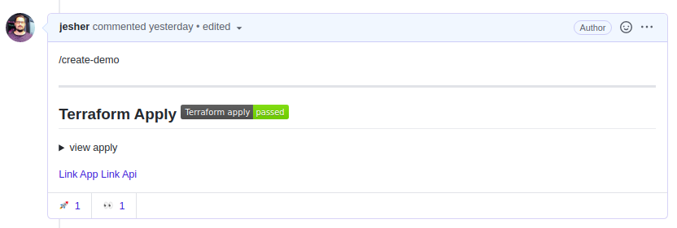
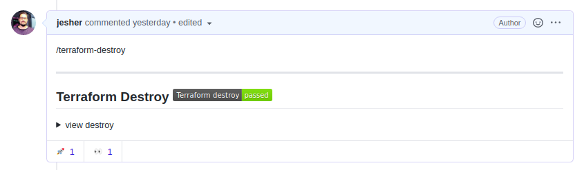

 

# Example ECS Fargate Deploy
Creating an ECS infrastructure example in AWS using terraform and deploying the application and API to the Cluster.

## Architecture


## Getting started

This project is an example, however, the steps bellow are predetermined to work in this model. If you want copying and implementing the same structure in your projects be my guest, but follow with attention the instructions detailed in the next sections.

### 1. Github secrets

Add secrets in your github account with your AWS credentials and create a personal access token [PAT](https://docs.github.com/en/free-pro-team@latest/github/authenticating-to-github/creating-a-personal-access-token)

```
AWS_ACCESS_KEY_ID
AWS_SECRET_ACCESS_KEY
REPO_ACCESS_TOKEN
```
> More info in [encrypted-secret](https://docs.github.com/pt/free-pro-team@latest/actions/reference/encrypted-secrets)
### 2. Terraform
You can run terraform by two ways, locally and through `github actions`, both will need to create a bucket for the backend. After you create that bucket change the file `infra/provider.tf` with your created bucket.

 ```HCL
terraform {
  backend "s3" {
    bucket = "<YOUR_BUCKET>"
    key    = "terraform/<YOUR_BUCKET>"
    region = "<YOUR_REGION>"
  }
}
 ```

### 3. ChatOps

It is easy to interact with this project we created a ChatOps comment when the pull request.

  > Command | Description
  > --- | ---
  > /terrafor-plan | terraform plan command is used to create an execution plan
  > /terrafor-apply | command is used to apply the changes
  > /terrafor-destroy | command is used to destroy
  > /help | command help
  > /create-demo | Create demo project
  > /build | Deploy application and API

<br>

__However, to work properly you've to create a pull request and run some commands exhibited in the table__

### 1. Create demo

> Fork this repository and follow the instructions below to see the magic happen

To create a small desmotração the project you must create a pull request and comment type the command: `/ create-demo`. This will create the environment for you if you have correctly configured the variables

A few minutes later a comment from terraform appears, after finishing the terraform application he will start building the application and API, it may take some time.



> In the commentary, there will be two links for you to access both application and API

If you want to destroy is so run the command `\terraform-destroy`


### 2. Run separately
If you want to run separately you should follow this order

1. `\terraform-plan`
2. `\terraform-apply`

If it has been no error in creating your environment you can run the command to perform the deploy

3. `\build`

If you want to destroy what was created just run

4. `\terraform-destroy`

### 3. Update application or API only
If you wanted to accomplish some change in the application or API to validate or test you do not need to perform the creation of the environment if it is already set up, just run `\build` it will update everything in ECS.

## Remarks

Some points bothers me even compared structure created in AWS, I am using public networks for the cluster in order to be able to download images of the ECR, the correct would be to create a NAT gateway and add private networks or [privatelink](https://aws.amazon.com/pt/blogs/compute/setting-up-aws-privatelink-for-amazon-ecs-and-amazon-ecr/) to resolve this issue

If something goes wrong contact-me and we'll fix the problems.

Cheers!!
